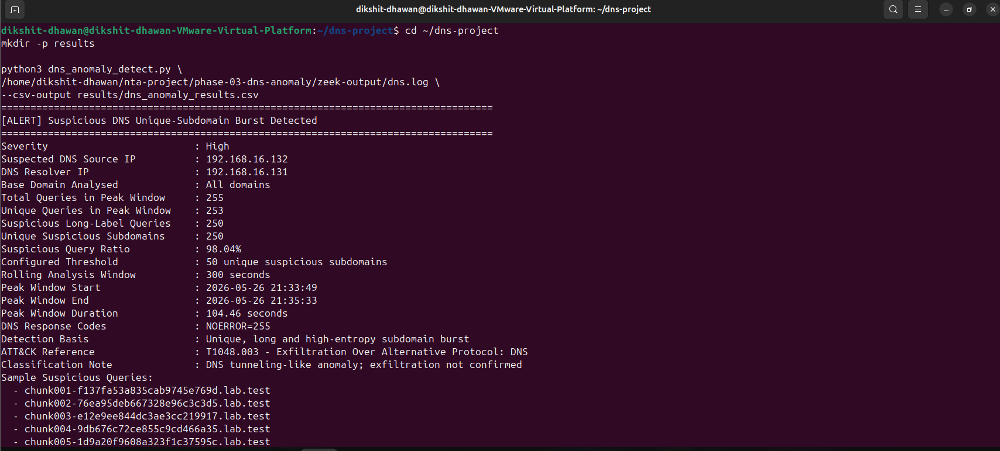
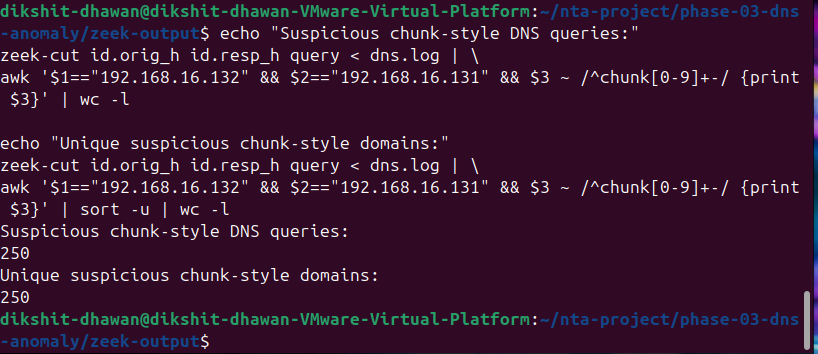
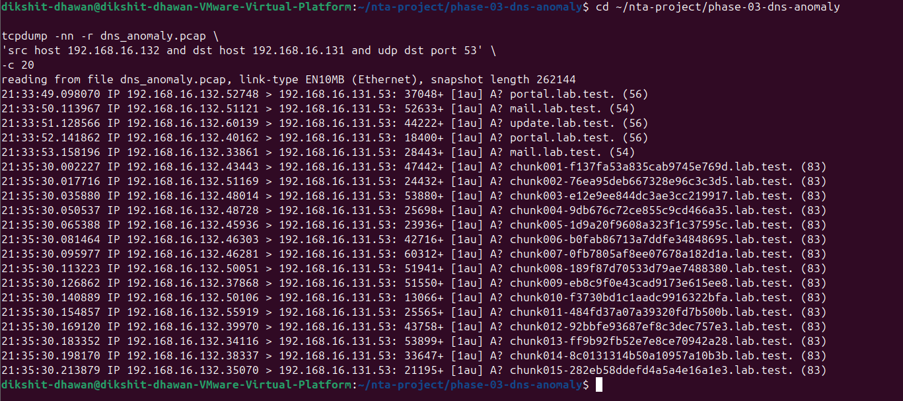

# DNS Anomaly Incident Report
## Investigation of Suspicious Unique-Subdomain Burst Activity

---

## Incident Identification

| Field | Recorded Detail |
|---|---|
| Incident ID | `NTA-DNS-2026-05-26-01` |
| Investigation Area | Network Traffic Analysis – DNS Anomaly Detection |
| Evidence Date | `2026-05-26` |
| Alert Severity | **High** |
| Detection Type | Suspicious DNS Unique-Subdomain Burst |
| Suspected Source IP | `192.168.16.132` |
| DNS Resolver IP | `192.168.16.131` |
| Observed Domain Pattern | `chunk###-<variable-string>.lab.test` |
| Analyst Disposition | DNS tunneling-like activity identified in controlled lab traffic |
| Exfiltration Status | Not confirmed from available network evidence |

---

## 1. Executive Summary

During Phase 03 of the network traffic analysis project, DNS activity generated by host `192.168.16.132` was captured and examined through Zeek logs, packet-level evidence, and a custom Python detector. The investigation identified a concentrated burst of unusual DNS queries directed to resolver `192.168.16.131`.

The activity was not consistent with ordinary browsing or common background name resolution. During the peak period, the source host generated **255 DNS queries** in approximately **104.46 seconds**. Of these, **250 queries** contained suspicious long-label, chunk-style subdomains, and all 250 were unique. The detector calculated a **98.04% suspicious query ratio**, far above the configured threshold of **50 unique suspicious subdomains** within a **300-second rolling window**.

The query format repeatedly followed a structure similar to:

```text
chunk001-f137fa53a835cab9745e769d.lab.test
chunk002-76ea95deb667328e96c3c3d5.lab.test
chunk003-e12e9ee844dc3ae3cc219917.lab.test
```

Rapidly changing, long, unique subdomains may be used to carry segmented or encoded information through DNS queries. The behaviour was therefore classified as a **high-confidence DNS tunneling-like anomaly**. It is mapped to MITRE ATT&CK technique `T1048.003`, as DNS can be abused as an alternative unencrypted protocol for outbound transfer.

The investigation does **not** claim that sensitive data was successfully exfiltrated. DNS logs and packet evidence establish a suspicious transfer-like pattern, but endpoint artefacts or recovered content would be required to confirm data loss.

---

## 2. Scope of Investigation

This report covers the detection and assessment of anomalous DNS traffic observed during the controlled project scenario. The investigation was conducted to:

- identify the systems involved in the suspicious DNS activity;
- determine the volume, uniqueness, and timing of the queries;
- validate whether the activity exceeded the configured anomaly threshold;
- preserve evidence from packet capture, Zeek logging, and detection results;
- classify the behaviour from a SOC investigation perspective; and
- document limitations and recommended response actions.

This report relates only to the DNS anomaly phase. Brute-force and port-scan findings are maintained as separate incidents in the repository.

---

## 3. Environment and Evidence Sources

### 3.1 Observed Systems

| Component | Role in Investigation |
|---|---|
| Source Host `192.168.16.132` | Generated the suspicious DNS query burst |
| Resolver / Destination `192.168.16.131` | Received and processed the DNS queries |
| Zeek Log Output | Recorded structured DNS transactions for analysis |
| Packet Capture | Preserved network traffic for validation |
| Custom Python Detector | Analysed DNS behaviour and generated the alert |

### 3.2 Evidence Artefacts

| Evidence Artefact | Repository Location | Purpose |
|---|---|---|
| DNS packet capture | `../PCAP/dns_anomaly/dns_anomaly.pcap` | Packet-level record of DNS traffic |
| Zeek DNS log | `../Zeek-Logs/dns_anomaly/dns.log` | Primary structured source for query review |
| Detection script | `../Detection-Scripts/dns_anomaly_detect.py` | Repeatable detection logic |
| Detector console output | `../Logs/dns_anomaly/dns_detection_output.txt` | Preserved alert output |
| CSV findings | `../Logs/dns_anomaly/dns_anomaly_results.csv` | Structured detection results |
| Technical analysis | `../Analysis/dns_anomaly_analysis.md` | Supporting investigative analysis |
| Evidence screenshots | `../Screenshots/dns_anomaly/` | Visual validation of capture, logs, and detection |

---

## 4. Detection Trigger and Alert Details

The custom detector reviewed the Zeek DNS log for bursts of unique, long, and high-entropy subdomain activity. The alert threshold was configured at **50 unique suspicious subdomains** within a **300-second rolling analysis window**.

The detector generated the following finding:

```text
[ALERT] Suspicious DNS Unique-Subdomain Burst Detected
Severity                       : High
Suspected DNS Source IP        : 192.168.16.132
DNS Resolver IP                : 192.168.16.131
Total Queries in Peak Window   : 255
Unique Queries in Peak Window  : 253
Suspicious Long-Label Queries  : 250
Unique Suspicious Subdomains   : 250
Suspicious Query Ratio         : 98.04%
Configured Threshold           : 50 unique suspicious subdomains
Rolling Analysis Window        : 300 seconds
Detection Basis                : Unique, long and high-entropy subdomain burst
Classification Note            : DNS tunneling-like anomaly; exfiltration not confirmed
```

### Alert Interpretation

| Metric | Result | Analyst Interpretation |
|---|---:|---|
| Total queries in peak window | 255 | Concentrated DNS burst over a short interval |
| Unique queries in peak window | 253 | Very limited repetition, consistent with generated queries |
| Suspicious long-label queries | 250 | Almost all requests carried anomalous labels |
| Unique suspicious subdomains | 250 | Strong tunneling-like indicator |
| Suspicious query ratio | 98.04% | Peak activity was dominated by suspicious traffic |
| Detection threshold | 50 | Alert threshold exceeded by 200 |
| Threshold multiple | 5x | High-confidence threshold breach |

---

## 5. Incident Timeline

| Time / Stage | Observation |
|---|---|
| Before anomalous burst | Baseline DNS activity and capture visibility were validated. |
| Capture initiation | DNS traffic capture was started for evidence collection. |
| `2026-05-26 21:33:49` | Start of the peak suspicious DNS window. |
| During peak window | Host `192.168.16.132` generated rapidly changing `chunk`-style DNS requests through resolver `192.168.16.131`. |
| `2026-05-26 21:35:33` | End of the peak suspicious DNS window. |
| Peak window duration | `104.46 seconds`. |
| Post-capture review | Zeek DNS data was inspected and query counts were manually validated. |
| Detection execution | The custom Python detector produced a High severity alert. |
| Evidence preservation | Detector results were stored in CSV and text-output formats. |

---

## 6. Technical Analysis

### 6.1 Query Volume and Timing

The identified peak contained **255 DNS queries** within **104.46 seconds**, representing an average rate of approximately **2.44 queries per second**:

```text
255 queries / 104.46 seconds ≈ 2.44 queries per second
```

Query rate alone would not be sufficient to classify an incident. Here, however, the rate appeared alongside high uniqueness, long variable labels, and a sequential chunk pattern. Taken together, these characteristics are more consistent with scripted or automated behaviour than normal interactive browsing.

### 6.2 Manual Log Validation

Manual analysis of the Zeek DNS log returned the following values:

| Validation Check | Observed Result |
|---|---:|
| Total DNS queries from suspected source | 255 |
| Unique queried domains from suspected source | 253 |
| Suspicious chunk-style DNS queries | 250 |
| Unique suspicious chunk-style domains | 250 |

These manually validated results match the key values generated by the detector. This agreement is significant because it confirms that the alert arose from observable log activity rather than relying only on automated classification.

### 6.3 Suspicious Query Structure

The detector recorded sample queries including:

```text
chunk001-f137fa53a835cab9745e769d.lab.test
chunk002-76ea95deb667328e96c3c3d5.lab.test
chunk003-e12e9ee844dc3ae3cc219917.lab.test
chunk004-9db676c72ce855c9cd466a35.lab.test
chunk005-1d9a20f9608a323f1c37595c.lab.test
```

Three features make this structure noteworthy:

1. **Sequential chunk markers:** Labels such as `chunk001`, `chunk002`, and `chunk003` indicate an ordered sequence rather than ordinary hostname requests.
2. **Long changing values:** Each query contains a variable hexadecimal-looking section compatible with encoded or segmented data.
3. **Stable parent domain with changing subdomains:** The changing data appears in the subdomain portion while the parent domain remains consistent, a familiar pattern in DNS tunneling tests.

The observed query naming pattern supports classification as transfer-like DNS activity, while not independently proving the content or success of a transfer.

### 6.4 DNS Response Behaviour

The detector reported:

```text
DNS Response Codes: NOERROR=255
```

All 255 detected requests received `NOERROR` responses. This establishes that the resolver processed the requests rather than immediately rejecting them. It does not prove that information was received outside the monitored environment or that sensitive data was transferred.

---

## 7. Detection and Validation Workflow

| Stage | Investigation Action | Evidence Produced |
|---|---|---|
| Capture | DNS traffic was recorded for later inspection. | `dns_anomaly.pcap`, capture screenshots |
| Log Generation | DNS traffic was represented through Zeek log output. | `dns.log`, Zeek screenshots |
| Initial Review | Client and resolver DNS visibility were verified. | Validation screenshots |
| Manual Validation | Counts for total, unique, and chunk-style queries were extracted from the DNS log. | `dns_query_count_validation.png` |
| Automated Detection | Custom Python script evaluated the suspicious query burst. | CSV output, text output, alert screenshot |
| Reporting | Findings were classified, limited appropriately, and documented. | Analysis and incident reports |

This workflow reflects a practical SOC investigation process: capture traffic, create searchable evidence, validate behaviour, automate detection, preserve findings, and produce a defensible incident conclusion.

---

## 8. Evidence Screenshots

The following evidence screenshots are stored under `../Screenshots/dns_anomaly/`:

| Screenshot File | Evidence Demonstrated |
|---|---|
| `baseline_dns_queries.png` | Baseline or initial DNS query behaviour |
| `dns_anomaly_query_generation.png` | Generation of suspicious DNS query activity |
| `tcpdump_dns_capture_started.png` | Start of packet capture for DNS evidence |
| `tcpdump_dns_capture_completed.png` | Completion of packet capture |
| `dns_pcap_initial_validation.png` | Initial packet-capture validation |
| `dns_anomaly_pcap_filtered_traffic.png` | Filtered packet view of relevant DNS traffic |
| `zeek_dns_logs_generated.png` | Zeek log generation from monitored activity |
| `zeek_dns_query_analysis.png` | Zeek-based DNS query review |
| `dns_client_resolution_validation.png` | Client-side DNS resolution validation |
| `dns_resolver_query_log.png` | Resolver-side DNS query visibility |
| `dns_query_volume_analysis.png` | Review of DNS query volume |
| `dns_query_count_validation.png` | Manual validation of 255 / 253 / 250 / 250 query figures |
| `dns_anomaly_detection_alert.png` | High-severity alert produced by the detector |

### Detection Alert Evidence



### Manual Query Validation Evidence



### Packet-Level Evidence



---

## 9. MITRE ATT&CK Mapping

| Attribute | Mapping |
|---|---|
| Tactic | Exfiltration |
| Technique ID | `T1048.003` |
| Technique | Exfiltration Over Alternative Protocol: Exfiltration Over Unencrypted Non-C2 Protocol |
| Protocol Observed | DNS |
| Mapping Basis | Burst of unique, structured, encoded-looking DNS labels compatible with attempted or simulated DNS-based transfer behaviour |

The mapping is based on behavioural evidence in the DNS queries. DNS may be abused to transport data through query labels. In this investigation, the repeated sequential `chunk` identifiers and changing long values are compatible with such activity.

This is a behavioural mapping for incident classification and does not establish completed exfiltration.

---

## 10. Severity Assessment

### Assigned Severity: High

| Severity Factor | Assessment |
|---|---|
| Volume of suspicious traffic | 250 suspicious queries identified during a short peak interval |
| Uniqueness | 250 unique suspicious subdomains |
| Anomalous ratio | 98.04% of peak-window queries assessed as suspicious |
| Threshold breach | Detected count was five times the configured threshold |
| Pattern quality | Sequential chunking with long changing subdomain labels |
| Potential risk | Possible covert DNS-based communication or transfer attempt |

In an operational environment, this pattern would justify immediate triage because it may represent malware communication, unauthorised tunneling, or attempted outbound data transfer. In this project, the traffic was investigated within a controlled lab context to demonstrate detection and incident analysis capability.

---

## 11. Impact Assessment

### Confirmed Observation

The available evidence confirms that:

- host `192.168.16.132` generated a large burst of suspicious DNS queries;
- resolver `192.168.16.131` processed those queries;
- the traffic was captured, logged, detected, and validated through repeatable analysis.

### Potential Impact in a Production Environment

If observed outside an authorised testing context, similar activity could indicate:

- data being encoded into DNS query labels for outbound transfer;
- use of DNS to avoid monitoring focused on web traffic;
- covert communication by a compromised system; or
- prolonged unauthorised network activity through trusted DNS infrastructure.

### Confirmed Data Loss

No data loss is confirmed in this investigation. Confirming exfiltration would require endpoint evidence, identification of the originating process, recovery or interpretation of transferred content, or correlation with access to sensitive files.

---

## 12. Response and Mitigation Recommendations

If this alert occurred in an organisational network, the following actions would be appropriate.

### Immediate Triage

1. Identify the asset associated with `192.168.16.132` and determine whether the activity was authorised.
2. Preserve DNS logs, packet captures, endpoint telemetry, and detector results.
3. Closely monitor or restrict DNS traffic from the suspected source pending investigation.
4. Determine whether the queried parent domain is expected in the environment.

### Follow-Up Investigation

1. Review running processes, scheduled tasks, scripts, command history, and network connections on the source endpoint.
2. Correlate the detected time window, `21:33:49` to `21:35:33`, with endpoint and user activity.
3. Inspect the packet capture for repeated transfer-like label structures and response behaviour.
4. Hunt for the same DNS pattern on other systems.
5. Check whether the source contacted additional suspicious destinations before or after the burst.

### Detection Improvements

1. Monitor unique subdomain count per host and parent domain over short time windows.
2. Alert on unusually long or high-entropy DNS labels when combined with burst activity.
3. Establish allowlists or baseline exceptions for approved services that legitimately generate dynamic DNS records.
4. Correlate DNS alerts with endpoint process execution and sensitive file access.
5. Retain PCAP, Zeek logs, and structured results for future comparison.

---

## 13. Limitations and Confidence Statement

### Limitations

- DNS logs establish query behaviour but do not identify the originating endpoint process.
- Encoded-looking labels do not by themselves prove confidential information was transmitted.
- `NOERROR` responses confirm successful query processing, not data theft.
- Production deployment would require threshold tuning against legitimate DNS behaviour.
- Endpoint and host forensic evidence would be required for a complete compromise determination.

### Confidence Statement

Confidence is **high** that the observed traffic represents intentional DNS tunneling-like behaviour because:

- 250 unique suspicious chunk-style subdomains were recorded;
- 98.04% of the detected peak traffic matched suspicious criteria;
- the observed count exceeded the detection threshold by five times;
- manual Zeek log analysis confirmed the detector's principal counts; and
- packet capture and log evidence were preserved.

Confidence is **not sufficient** to claim confirmed exfiltration of sensitive data.

---

## 14. Final Analyst Conclusion

The investigation identified a clear burst of anomalous DNS traffic originating from `192.168.16.132` and directed through resolver `192.168.16.131`. During a 104.46-second peak window, 255 DNS queries were recorded, including 250 unique suspicious long-label queries using a sequential `chunk` naming convention. The suspicious query ratio reached 98.04%, while the unique suspicious subdomain count exceeded the configured alert threshold by five times.

The finding was independently verified through manual Zeek log analysis and is supported by packet capture, structured logs, and detector output. The activity is correctly classified as **DNS tunneling-like behaviour** and mapped to MITRE ATT&CK technique `T1048.003`.

The evidence demonstrates successful network-level detection and investigation of a DNS anomaly. It does not establish completed data exfiltration. The final incident disposition is therefore:

> **High-severity DNS tunneling-like anomaly detected. The observed activity is consistent with simulated or attempted DNS-based transfer behaviour; confirmed data exfiltration is not established from the available evidence.**

---

## Evidence Reference Index

```text
Incident-Reports/
└── dns_anomaly.md

Analysis/
└── dns_anomaly_analysis.md

Detection-Scripts/
└── dns_anomaly_detect.py

Logs/
└── dns_anomaly/
    ├── dns_anomaly_results.csv
    └── dns_detection_output.txt

PCAP/
└── dns_anomaly/
    └── dns_anomaly.pcap

Screenshots/
└── dns_anomaly/
    ├── baseline_dns_queries.png
    ├── dns_anomaly_detection_alert.png
    ├── dns_anomaly_pcap_filtered_traffic.png
    ├── dns_anomaly_query_generation.png
    ├── dns_client_resolution_validation.png
    ├── dns_pcap_initial_validation.png
    ├── dns_query_count_validation.png
    ├── dns_query_volume_analysis.png
    ├── dns_resolver_query_log.png
    ├── tcpdump_dns_capture_completed.png
    ├── tcpdump_dns_capture_started.png
    ├── zeek_dns_logs_generated.png
    └── zeek_dns_query_analysis.png

Zeek-Logs/
└── dns_anomaly/
    └── dns.log
```
