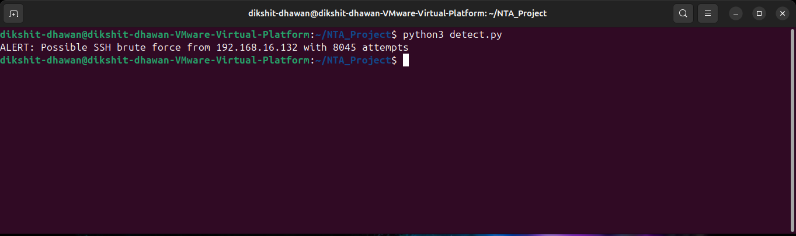
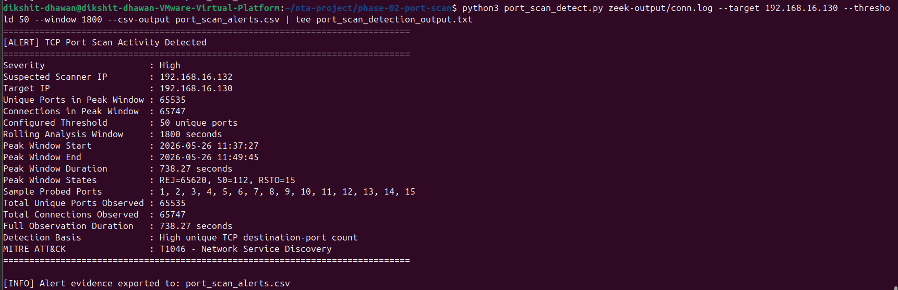

# Network Traffic Analysis & Threat Detection Lab

A practical network-security investigation lab built around packet capture, Zeek telemetry, Wireshark validation, Nmap evidence, and Python-based behavioural detection. The repository documents three controlled attack scenarios against a Windows target: SSH brute force, full TCP port scanning, and DNS tunneling-like anomaly activity.

The focus of this project is not simply generating attack traffic. Each case follows an analyst workflow: capture the activity, identify the source from network evidence, validate the behaviour at packet or log level, run a detection rule, and preserve the findings in an incident report.

---

## Lab Summary

| Area | Details |
|---|---|
| Monitoring and analysis host | Ubuntu Linux running `tcpdump`, Zeek and Wireshark |
| Simulated attacker | Kali Linux |
| Target host | Windows 11 |
| Network design | Isolated virtual lab network |
| Primary telemetry | Zeek logs and retained PCAP files |
| Detection approach | Python rules based on observable network behaviour |
| Completed investigations | SSH Brute Force, TCP Port Scan, DNS Anomaly |

---

## Investigation Workflow

```text
Traffic Generation
        ↓
Packet Capture with tcpdump
        ↓
Zeek Log Generation
        ↓
Manual Log and Packet Validation
        ↓
Python Behavioural Detection
        ↓
Alert Evidence Preservation
        ↓
Incident Report and ATT&CK Mapping
```

The detection scripts are intentionally based on traffic behaviour rather than pre-lab assumptions. The port-scan and DNS-anomaly detectors identify suspicious activity from observed source-to-target or source-to-resolver patterns; the brute-force detector confirms repeated SSH connection attempts visible in the retained Zeek evidence.

---

## Confirmed Findings

| Investigation | Key Finding | Source | Target / Resolver | Detection Result | ATT&CK Reference |
|---|---|---|---|---|---|
| SSH Brute Force | Repeated SSH connection attempts on TCP/22 | `192.168.16.132` | `192.168.16.130` | `8,045` SSH attempts detected | `T1110` – Brute Force |
| Full TCP Port Scan | Automated probing of the complete TCP port range | `192.168.16.132` | `192.168.16.130` | `65,535` unique ports; `65,747` connections | `T1046` – Network Service Discovery |
| DNS Anomaly | Burst of unique, long-label `chunk` DNS queries | `192.168.16.132` | Resolver `192.168.16.131` | `250` unique suspicious subdomains; `98.04%` suspicious ratio | `T1048.003` – Exfiltration Over Alternative Protocol: DNS |

> This repository records controlled lab activity. The DNS case demonstrates tunneling-like behaviour; it does not claim confirmed exfiltration or compromise.

---

# Case 01 — SSH Brute Force Detection

## Objective

The first investigation examined repeated SSH traffic against the Windows target. The goal was to determine whether a single source repeatedly attempted to reach the SSH service and whether that pattern could be extracted from Zeek connection telemetry.

## Finding

The detector identified the following activity:

```text
ALERT: Possible SSH brute force from 192.168.16.132 with 8045 attempts
```

| Finding | Confirmed Value |
|---|---|
| Suspected source IP | `192.168.16.132` |
| Target IP | `192.168.16.130` |
| Target service | SSH / TCP `22` |
| Detected SSH connection attempts | `8,045` |
| Classification | Automated SSH brute-force activity |

The traffic pattern shows a single source repeatedly contacting the target's SSH service within the captured evidence set. This is consistent with a password-guessing/brute-force attempt in the controlled environment.

## Evidence

| Evidence Type | File |
|---|---|
| Technical analysis | [`Analysis/brute_force_analysis.md`](Analysis/brute_force_analysis.md) |
| Incident report | [`Incident-Reports/brute_force.md`](Incident-Reports/brute_force.md) |
| Detection script | [`Detection-Scripts/brute_force_detect.py`](Detection-Scripts/brute_force_detect.py) |
| Detection output | [`Logs/brute_force/brute_force_detection_output.txt`](Logs/brute_force/brute_force_detection_output.txt) |
| Packet capture | [`PCAP/brute_force/bruteforce.pcap`](PCAP/brute_force/bruteforce.pcap) |
| Zeek logs | [`Zeek-Logs/brute_force/`](Zeek-Logs/brute_force/) |
| Supporting screenshots | [`Screenshots/brute_force/`](Screenshots/brute_force/) |

### Detection Evidence



---

# Case 02 — Full TCP Port Scan Detection

## Objective

The second investigation analysed network reconnaissance activity against the Windows target. Rather than assuming which host performed the scan, Zeek `conn.log` evidence and a Python detector were used to identify the source that contacted an unusually large number of destination ports.

## Finding

A full TCP port scan was confirmed from `192.168.16.132` against `192.168.16.130`.

| Detection Field | Confirmed Value |
|---|---|
| Suspected scanner IP | `192.168.16.132` |
| Target IP | `192.168.16.130` |
| Unique TCP destination ports contacted | `65,535` |
| Total TCP connections observed | `65,747` |
| Observation duration | `738.27 seconds` |
| Configured detection threshold | `50 unique ports` |
| Detection severity | High |
| ATT&CK mapping | `T1046` – Network Service Discovery |

### Connection-State Review

| Zeek State | Count | Interpretation |
|---|---:|---|
| `REJ` | `65,620` | Majority of scanned ports rejected the probe |
| `S0` | `112` | Connection attempts observed without completed responses |
| `RSTO` | `15` | Small set of distinct response behaviours requiring verification |

### Verified Responding Services

Targeted service verification identified four accessible services on the Windows host:

| Port | Service | Verification Detail |
|---:|---|---|
| `22/tcp` | SSH | OpenSSH for Windows 9.5 |
| `135/tcp` | MSRPC | Microsoft Windows RPC |
| `139/tcp` | NetBIOS-SSN | Microsoft Windows netbios-ssn |
| `445/tcp` | `microsoft-ds?` | Recorded as identified by Nmap, including uncertainty marker |

The investigation confirms reconnaissance activity, not exploitation. In a real environment, these findings would require correlation with authentication failures, exploit attempts, or endpoint alerts.

## Evidence

| Evidence Type | File |
|---|---|
| Technical analysis | [`Analysis/port_scan_analysis.md`](Analysis/port_scan_analysis.md) |
| Incident report | [`Incident-Reports/port_scan.md`](Incident-Reports/port_scan.md) |
| Detection script | [`Detection-Scripts/port_scan_detect.py`](Detection-Scripts/port_scan_detect.py) |
| Detector alert export | [`Logs/port_scan/port_scan_alerts.csv`](Logs/port_scan/port_scan_alerts.csv) |
| Detection output | [`Logs/port_scan/port_scan_detection_output.txt`](Logs/port_scan/port_scan_detection_output.txt) |
| Nmap outputs | [`Logs/port_scan/nmap/`](Logs/port_scan/nmap/) |
| Packet capture | [`PCAP/port_scan/port_scan.pcap`](PCAP/port_scan/port_scan.pcap) |
| Zeek logs | [`Zeek-Logs/port_scan/`](Zeek-Logs/port_scan/) |
| Supporting screenshots | [`Screenshots/port_scan/`](Screenshots/port_scan/) |

### Detection Evidence



---

# Case 03 — DNS Anomaly Detection

## Objective

The final investigation examined DNS traffic for patterns associated with covert or tunneling-like communication. A normal DNS workflow generally produces readable or repeated domain requests. In this case, the detector was designed to identify bursts of long, high-entropy, rapidly changing subdomain labels.

## Finding

A high-severity suspicious DNS unique-subdomain burst was detected from `192.168.16.132` through resolver `192.168.16.131`.

| Detection Field | Confirmed Value |
|---|---|
| Suspected DNS source IP | `192.168.16.132` |
| DNS resolver IP | `192.168.16.131` |
| Total queries in peak window | `255` |
| Unique queries in peak window | `253` |
| Suspicious long-label queries | `250` |
| Unique suspicious subdomains | `250` |
| Suspicious query ratio | `98.04%` |
| Threshold | `50 unique suspicious subdomains` |
| Rolling analysis window | `300 seconds` |
| Peak window | `2026-05-26 21:33:49` to `21:35:33` |
| Peak duration | `104.46 seconds` |
| DNS response codes | `NOERROR=255` |
| ATT&CK mapping | `T1048.003` – Exfiltration Over Alternative Protocol: DNS |

### Observed Query Pattern

```text
chunk001-f137fa53a835cab9745e769d.lab.test
chunk002-76ea95deb667328e96c3c3d5.lab.test
chunk003-e12e9ee844dc3ae3cc219917.lab.test
```

The sequential `chunk` marker, changing long subdomain content, and high query uniqueness support the finding of DNS tunneling-like behaviour. Manual Zeek log validation independently reproduced the detector's principal counts:

| Manual Validation Check | Result |
|---|---:|
| Total DNS queries from suspected source | `255` |
| Unique queried domains | `253` |
| Suspicious chunk-style DNS queries | `250` |
| Unique suspicious chunk-style domains | `250` |

The incident is classified as a high-severity network anomaly. Since the evidence is network-level and collected in a controlled lab, it does not establish that real sensitive information was transferred.

## Evidence

| Evidence Type | File |
|---|---|
| Technical analysis | [`Analysis/dns_anomaly_analysis.md`](Analysis/dns_anomaly_analysis.md) |
| Incident report | [`Incident-Reports/dns_anomaly.md`](Incident-Reports/dns_anomaly.md) |
| Detection script | [`Detection-Scripts/dns_anomaly_detect.py`](Detection-Scripts/dns_anomaly_detect.py) |
| Detector result export | [`Logs/dns_anomaly/dns_anomaly_results.csv`](Logs/dns_anomaly/dns_anomaly_results.csv) |
| Detection output | [`Logs/dns_anomaly/dns_detection_output.txt`](Logs/dns_anomaly/dns_detection_output.txt) |
| Packet capture | [`PCAP/dns_anomaly/dns_anomaly.pcap`](PCAP/dns_anomaly/dns_anomaly.pcap) |
| Zeek DNS log | [`Zeek-Logs/dns_anomaly/dns.log`](Zeek-Logs/dns_anomaly/dns.log) |
| Supporting screenshots | [`Screenshots/dns_anomaly/`](Screenshots/dns_anomaly/) |

### Detection Evidence


### Manual Validation Evidence


---

## Tools Used

| Tool / Technology | Purpose in This Lab |
|---|---|
| `tcpdump` | Captured network traffic for evidence preservation |
| Zeek | Converted captured network traffic into investigation-ready logs |
| Wireshark | Validated packet-level behaviour and response patterns |
| Nmap | Generated and verified port-scan/service-discovery evidence |
| Python | Implemented behaviour-based detectors and preserved alert outputs |
| Kali Linux | Simulated controlled attack traffic |
| Windows 11 | Served as the monitored target system |
| Ubuntu Linux | Functioned as the monitoring and analysis node |

---

## Repository Structure

```text
NTA-Zeek-Threat-Detection-Lab/
├── .gitignore
├── LICENSE
├── README.md
│
├── Analysis/
│   ├── brute_force_analysis.md
│   ├── port_scan_analysis.md
│   └── dns_anomaly_analysis.md
│
├── Detection-Scripts/
│   ├── brute_force_detect.py
│   ├── port_scan_detect.py
│   └── dns_anomaly_detect.py
│
├── Incident-Reports/
│   ├── brute_force.md
│   ├── port_scan.md
│   └── dns_anomaly.md
│
├── Logs/
│   ├── brute_force/
│   │   └── brute_force_detection_output.txt
│   ├── port_scan/
│   │   ├── port_scan_alerts.csv
│   │   ├── port_scan_detection_output.txt
│   │   └── nmap/
│   │       ├── port_scan_full_tcp.txt
│   │       ├── port_scan_service_verification.txt
│   │       └── port_scan_top100.txt
│   └── dns_anomaly/
│       ├── dns_anomaly_results.csv
│       └── dns_detection_output.txt
│
├── PCAP/
│   ├── brute_force/
│   │   └── bruteforce.pcap
│   ├── port_scan/
│   │   └── port_scan.pcap
│   └── dns_anomaly/
│       └── dns_anomaly.pcap
│
├── Screenshots/
│   ├── brute_force/
│   ├── port_scan/
│   └── dns_anomaly/
│       ├── baseline_dns_queries.png
│       ├── dns_anomaly_detection_alert.png
│       ├── dns_anomaly_pcap_filtered_traffic.png
│       ├── dns_anomaly_query_generation.png
│       ├── dns_client_resolution_validation.png
│       ├── dns_pcap_initial_validation.png
│       ├── dns_query_count_validation.png
│       ├── dns_query_volume_analysis.png
│       ├── dns_resolver_query_log.png
│       ├── tcpdump_dns_capture_completed.png
│       ├── tcpdump_dns_capture_started.png
│       ├── zeek_dns_logs_generated.png
│       └── zeek_dns_query_analysis.png
│
└── Zeek-Logs/
    ├── brute_force/
    ├── port_scan/
    └── dns_anomaly/
        └── dns.log
```

---

## Detection Approach

The project uses practical, evidence-oriented detection logic:

| Detection Case | Behaviour Analysed | Why It Matters |
|---|---|---|
| SSH Brute Force | Repeated TCP/22 connection attempts from one source | May indicate password guessing against a remote-access service |
| TCP Port Scan | One source probing many destination ports on one target | Reveals network reconnaissance and exposed services |
| DNS Anomaly | Burst of unique long-label DNS queries | May indicate covert signalling or DNS-based transfer behaviour |

The detectors are not intended to replace a production IDS or SIEM rule set. They serve as transparent detection logic that can be reviewed, tested against retained evidence, and extended with thresholds or additional correlations.

---

## Analyst Notes and Limitations

- All traffic in this repository was generated within a controlled lab environment.
- A port scan confirms reconnaissance behaviour but does not confirm exploitation.
- SSH brute-force traffic confirms repeated access attempts; it does not by itself confirm successful authentication.
- The DNS anomaly confirms a tunneling-like query pattern; it does not confirm data exfiltration.
- A production investigation would require endpoint logs, authentication records, process telemetry, and business-context validation in addition to network evidence.

---

## Project Outcome

This lab demonstrates an end-to-end entry-level SOC investigation workflow across three different network behaviours:

- authentication-targeting activity through repeated SSH attempts;
- reconnaissance through a complete TCP port scan; and
- DNS-based covert-channel indicators through unique long-label query bursts.

For each scenario, the repository retains the packet evidence, relevant Zeek telemetry, detector logic, findings, screenshots, and incident documentation required to explain how the alert was reached and what its limitations are.

---

## Author

**Dikshit Dhawan**  
B.Tech, Computer Science and Engineering  
Cybersecurity | Network Traffic Analysis | Detection Engineering
